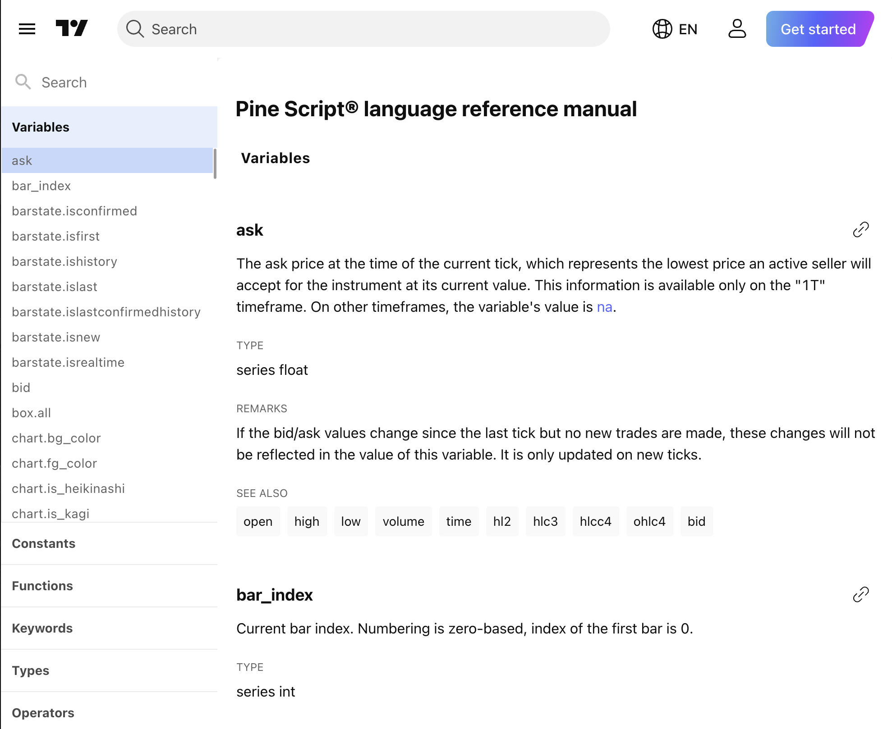

# Pine Script v6 Documentation

  

This repository contains a structured JSON dataset extracted from the [TradingView Pine Script v6 Documentation](https://www.tradingview.com/pine-script-reference/v6/).

It is designed to provide clean, machine-readable access to Pine Script v6 reference information, suitable for:

- Model Context Protocol (MCP) usage (e.g., Context7, Cursor)
- Retrieval-Augmented Generation (RAG) systems
- AI-assisted Pine Script development
- Searchable documentation servers

---

## 📦 What's included

Each entry captures:

- `heading`: The name of the function, annotation, variable, keyword, type, or operator.
- `type`: The general classification (Functions, Variables, Constants, etc.).
- `description`: Full human-readable explanation.
- `remarks`: Important notes, warnings, or behavior quirks.
- `examples`: Array of code examples related to the entry.
- `related_links`: Array of links to related documentation entries.

---

## 📚 Data Source

- Source: [TradingView Official Pine Script v6 Reference](https://www.tradingview.com/pine-script-reference/v6/)
- Extraction: Scraped and structured manually using Firecrawl to capture full heading, description, remarks, examples, and related links.
- Scope: Covers sections under:
  - Variables
  - Constants
  - Functions
  - Keywords
  - Types
  - Operators
  - Annotations

  

*Note:* Minor formatting cleanup was performed to ensure machine compatibility. No content was altered from the source.

---
# Pine Script v6 Structured Reference

## 📁 Files

| File | Description |
|:-----|:------------|
| `pinescript_v6_reference.json` | Full structured reference for Pine Script v6 |

---

## ⚙️ Intended Use

- Plug directly into Context7 or Cursor as a `reference`-type MCP source.
- Use with RAG pipelines for Pine Script-aware LLM agents.
- Build smarter Pine Script assistants without depending on live web lookups.

---

## ⚠️ Limitations

- This dataset is based on TradingView’s public documentation as of **April 2025**.
- It will not automatically include future updates to Pine Script (e.g., v7 changes).
- Some remarks and examples rely on TradingView-specific behavior and might vary slightly across versions.

---

## 📜 License

MIT License

Feel free to fork, modify, and use for any personal, educational, or commercial purpose.  
Attribution appreciated but not required.

---
